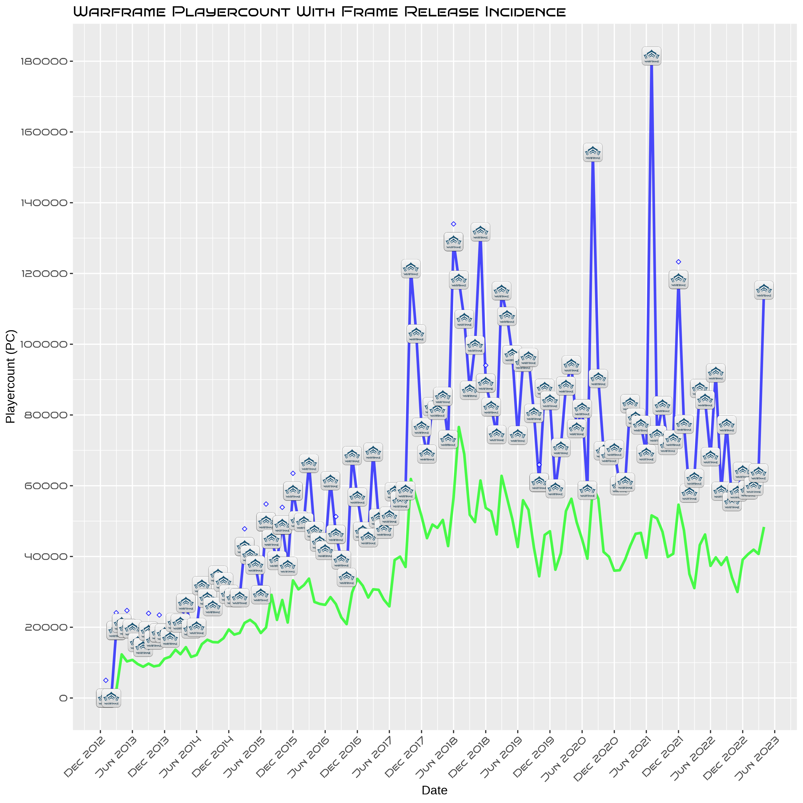

# WARFRAME


```{r setup, include=FALSE}
knitr::opts_chunk$set(warning = FALSE, echo = FALSE)
library(plotly)
library(dplyr)
library(rvest)
library(tidyverse)
library(here)
library(stringr)
library(lubridate)
library(zoo)
library(ggimage)
library(scales)
library(showtext)
library(readr)
library(vembedr)
library(Hmisc)
```

[Warframe](https://www.warframe.com/) is an online game available on all consoles. It allows 1-4 players to play as the titular 'Warframes'(colloquially named 'space ninjas' or simply 'Frames'), blazing through hordes of enemies from multiple factions, on multiple planets with an assortment of over 1000 weapons, and devastating abilities. 

```{r echo=FALSE}
#suggest_embed("https://youtu.be/9O-yCnQKYhM?")
#Warframe trailer embedded in github:

embed_youtube("9O-yCnQKYhM") %>% use_start_time("101")
```
Warframe is a rather unique game as it is entirely *free to play*(FTP), paying money can help skip some of the grind, but even that can be done in game for free via trading with other players. In fact the only items unobtainable to FTP players are a small handful of cosmetics. 
Despite the minimal monetization, Digital Extremes have managed to keep this game relevant and profitable for 10 years.        

## Research Question:

My aim is investigate whether there is an association between the active monthly playercount in the game Warframe and the release of new 'frames'(Classes) within the game.

## Data Origins:

Using **rvest** and the [selectorgadget](https://chrome.google.com/webstore/detail/selectorgadget/mhjhnkcfbdhnjickkkdbjoemdmbfginb?hl=en) chrome extension, I have managed to scrape monthly playercount data from [steamcharts](https://steamcharts.com/app/230410) to create the following dataframe: 

```{r echo=TRUE, message=FALSE, warning=FALSE}

#designating the URL to scrape from:

link = "https://steamcharts.com/app/230410"
page = read_html(link)

#Converting webpage tags into variable lists: 

date = page %>% html_nodes(".left") %>%  html_text()
avg = page %>% html_nodes(".left+ .right") %>%  html_text() 
gain = page %>% html_nodes(".right:nth-child(3)") %>%  html_text() 
pctgain = page %>% html_nodes(".right:nth-child(4)") %>%  html_text() 
peak = page %>% html_nodes(".right:nth-child(5)") %>%  html_text() 

#combining lists as columns to create the 'playercount' dataframe:

playercount = data.frame(date, avg, gain, pctgain, peak, stringsAsFactors = FALSE)

#Here is a sample of the raw playercount dataframe:
head(playercount)

#Creating an archived backup CSV of data frame in case URL is compromised:
#write.csv(playercount,"CSVs\\playercount.csv")

#If URL does get compromised the following code will retrieve the archived dataframe from 09/05/23:

#playercount <- read_csv("CSVs/playercount.csv")
```

I was able to do this by stating the relevant URL for the website -in which the data was held-, identifying the relevant website tags -via selectorgadget- for each desired dataframe column and running a script to convert the html nodes (tags) into string variables. I then combined the variables as columns within the dataframe.   

I repeated this process for the dataframe below depicting the release dates of new frames (classes) within Warframe: 
```{r echo=FALSE, message=FALSE, warning=FALSE}

#Scraping data for release dates of new classes (frames), same process as above:

link = "https://gamertweak.com/warframe-prime-release-order/"
page = read_html(link)

frame = page %>% html_nodes("td:nth-child(1)") %>%  html_text()
release = page %>% html_nodes("td:nth-child(2)") %>%  html_text()

framerel = data.frame(frame, release, stringsAsFactors = FALSE)

#here is raw dataframe for framerel:
head(framerel)

#Creating an archived backup CSV of data frame in case URL is compromised:
#write.csv(framerel,"CSVs\\framerel.csv")

#If URL does get compromised the following code will retrieve the archived dataframe from 09/05/23:

#framerel <- read_csv("CSVs/framerel")
```

## Data Preparation:

```{r echo=FALSE}
#Some tidying:

playercount <- playercount %>% 
  mutate_at("date", str_replace, "\n\t\t\t\t\t", "") %>% 
  mutate_at("date", str_replace, "\n\t\t\t\t", "")
  
playercount <- playercount[-1, ]
playercount <- playercount[-1, ]

```

```{r echo=FALSE}
#tidying:
framerel <- framerel[-1, ] 

```

I found the trickiest aspect of data wrangling to be the transformation of dates. for both dataframes, I separated the individual aspects of the date column, created a new variable list assigning the numerical value 1-12 to the relevant months and then ran a script to add a new column to each dataframe containing the relevant numerical value for each month. I then ran a script to combine the month and year values for each dataframe into a single date column which was now identical across dataframes, allowing for dataframe merging later. I then reformatted the columns of my dataframes to just relevant data for ease of use:    
```{r echo=TRUE}
#splitting dates:
framerel <-  framerel %>% separate(release, c('Day', 'Month', 'Year'))

playercount <- playercount %>% separate(date, c('pmonth', 'pyear'))

#converting month names to factor: 
playercount[, 1] <- sapply(playercount[, 1], as.factor)

framerel[, 3] <-  sapply(framerel[, 3], as.factor)

#adding new column for month number:
months_number<-list(January=1,February=2,March=3,April=4,May=5,June=6, July=7,August=8,September=9,October=10,November=11,December=12)

playercount <- playercount %>% mutate(pmonthnum=recode(pmonth,!!!months_number))

framerel <- framerel %>% mutate(monthnum=recode(Month,!!!months_number))

#converting variables to numeric (and tidying):
playercount <- playercount %>% 
  mutate_at("pctgain", str_replace, "%", "")

playercount[, c(2:7)] <- sapply(playercount[, c(2:7)], as.numeric)

#recombining dates:
playercount$date <- as.yearmon(paste(playercount$pmonthnum, playercount$pyear), "%m %Y")

framerel$date <- as.yearmon(paste(framerel$monthnum, framerel$Year), "%m %Y")

#removing non-relevant columns & reordering column order: 
playercount <- playercount[, c(8, 6, 3)]

framerel <- framerel[, c(6,1)]

#Should now have 2 organised dataframes: 
```

```{r echo=FALSE}
head(playercount)
head(framerel)
```

**Combining datasets:**
I ran a code to merge my datasets, using the - now identically formatted - dates as row references. I included the additional argument "all.x = TRUE" as the framerel dataframe included repeats of months where multiple frames had been released in the same month. I created a line of code using "ifelse(frame!="NA"" to create a new column within the merged dataframe containing the values of the peak column, only for rows that contained the release of a frame. This new column is used later to add geom points to the graph, depicting when frames were released. 
In this state, geom points would overlap in instances where multiple frames were released in the same month. After experimenting with different options- including the use of geom_growth instead of point, and the use of jitter-, I opted to run a 'For Loop' to add a value of 5000 to any value within the frpeak (geom point) column that had the same value as the previous row. This allowed for all geom points to be visible.  
```{r echo=TRUE}
#Create combined dataframe:
  
merged <- merge(playercount, framerel, by.x = "date", all.x = TRUE)
#adding column to allow for geom points overlaying only the relevent timepoints:  
merged$frpeak <- with(merged, ifelse(frame!="NA", peak))

#for loop to add 5000 to Y value for geom points if y value is equal:
for (i in 2:nrow(merged)) {if (!is.na(merged$frpeak[i]) & !is.na(merged$frpeak[i-1]) & merged$frpeak[i] == merged$frpeak[i-1]) {merged$frpeak[i] <- merged$frpeak[i] + 5000}}
```

```{r echo=FALSE}
#reformatting dates (post dataframe merge), to allow for scaling of x axis
playercount$date <- as_date(playercount$date, format= "%b_%Y")

merged$date <- as.Date(merged$date)

merged_date <- format(merged$date, "%b %Y")

merged$merged_date <- merged_date

#Creating CSV backup for the merged dataframe:

#write.csv(merged,"CSVs\\merged.csv")

#In case of emergency, remove "#":

#merged <- read_csv("CSVs/merged.csv")
```

I then implemented a custom image for my geom points by taking an image via URL and adding it to all rows as a new column in the dataframe.     
```{r echo=TRUE}
#adding image column for custom points:

#creating variable list of image URL repeated 138 times (no. of merged dataframe rows).
image <- rep("https://warframe-school.com/wp-content/uploads/2018/07/Warframe-Logo.png", times=138)

#merging the image column to the merged dataframe:
merged <- cbind(merged, image)


head(merged)
```

```{r echo=FALSE}
#Other prototype images:

#https://warframe-school.com/wp-content/uploads/2018/07/Warframe-Logo.png

#https://e7.pngegg.com/pngimages/806/570/png-clipart-warframe-playerunknown-s-battlegrounds-fortnite-playstation-4-android-warframe-blue-logo.png

#https://cutewallpaper.org/24/warframe-logo-png/warframe-logo-logodix.png
```

I downloaded a custom font into the project folder to use for the axis labels and title:
```{r echo=TRUE}
font_add(family = "Bruno_SC_Ace", "Fonts\\BrunoAceSC-Regular.ttf")

showtext_auto()
#adding this prevents microscopic font sizes on axis when exporting plots via ggsave:
showtext_opts(dpi=300)
```

**The woes of plotly customization:**

By adding a line of code to the graph code (n<- m + geom_image(aes(image=image), size= 0.03)), I was able to use the custom image as points for a ggplot graph. However, when attemping to use this with ggplotly, it was revealed that this had not yet been added to the plotly package.

I then ran into the exact same problem for the use of custom text. There is supposedly a way to allow for custom text with plotly, however this requires the custom text to have been pre-downloaded onto the computer (not just within project) running the code - crippling code replication and portability-. I found a comment on [This page, by cttnguyen](https://github.com/plotly/plotly.R/issues/2117), detailing a workaround, however the required code for this fix was perplexing so I avoided it.  

This is my what my plot could have been if plotly was compatible with custom fonts and geom images. Due to the lack of interaction, and legibility issues with the custom geom image, I decided it was less informative than an interactive plot:
```{r include=FALSE}
#defining graph basis and text/variables to include in plotly hover text box:
m <- ggplot(data = merged, aes(x = date, y=peak, group=1,
  text = paste("Date: ", merged_date, "<br>Peak: ", peak, "<br>Average: ", avg))) +
  #line to represent daily peak playercount, averaged monthly: 
   geom_line(colour = "blue", size=1.1, alpha=0.7,aes(x=date, y = peak, group= 1))+
  #line to represent daily average playercount, averaged monthly:
   geom_line(colour = "green", size=1.1, alpha=0.7, aes(x=date,y= avg, group= 1)) +
  #points to represent release of frames on peak line:
   geom_point(shape=23, colour= "blue", fill="white", alpha=0.8, size= 1.2, aes(x=date, y=frpeak, group=2, 
  text = paste("Date: ", merged_date, "<br>Peak: ", peak, "<br>Average: ", avg, "<br>New Warframe:", frame), alpha=0.7))

#adding scales:
 #expanding limits to use playercount df date column (no repeated values):
m<- m + expand_limits(x = playercount$date) +
  #breaking scale into 6 month intervals:
  scale_x_date(date_breaks = "6 months", date_labels = "%b %Y")+
  #adding custom font & asjusring x label angle:
  theme(axis.text.x = element_text(family = "Bruno_SC_Ace", angle = 45, hjust = 1))+
  #breaking scale into 20,000 intervals with minor breaks inbetween:
  scale_y_continuous(breaks = round(seq(min(merged$avg), max(merged$peak), by = 20000)),
                      minor_breaks = seq(min(merged$avg), max(merged$peak), by = 10000))+
   #adding custom text to y labels: 
  theme(axis.text.y = element_text(family = "Bruno_SC_Ace"))+
  #adding title with custom text:
  labs(title= "Warframe Playercount With Frame Release Incidence", x= "Date", y= "Playercount (PC)") + theme(plot.title = element_text(family = "Bruno_SC_Ace"))

#adding custom image as geom point:
n<- m + geom_image(aes(image=image), size= 0.03)

#gglot with custom image & font - font will look massive within R, but is scaled appropriately when exported via png.
n
#saving and exporting plot as png: 
ggsave(filename = file.path("plots","custom proto.png"), width = 10, height = 10, dpi = 300)
```



```{r}
#same graph applied through ggplotly (custom image & font is removed):
#ggplotly(n, tooltip = "text")
```

## Final Graph:

Below is my final plot, demonstrating the trends of playercount over the 10 year period in which Warframe has been released. The geom points demonstrate when new frames were released and provide information when hovered over. 
```{r, fig.width=10,fig.height=6, echo=TRUE}  

#defining plot basis & indicating text for ggplotly hover text box:
g <- ggplot(data = merged, aes(x = date, group=1,
  text = paste("Date: ", merged_date, "<br>Peak: ", peak, "<br>Average: ", avg))) +
  #line for peak daily playercount, averaged over a month:
   geom_line(size=1.1, alpha=0.7,aes(y = peak, colour = "Peak", group= 1))+
  #line for mean average daily playercount, averaged over a month:
   geom_line(size=1.1, alpha=0.9, aes(y= avg, colour = "Average", group= 1)) +
  #points to depict frame release aong the peak geom_line. Shape and colours customized:
   geom_point(shape=23,  fill="white", alpha=0.8, size= 1.2, aes(x=date, y=frpeak,colour= "New Frame Released", group=2, 
  #adding altered text for ggplotly hover text box with name of released frame:
  text = paste("Date: ", merged_date, "<br>Peak: ", peak, "<br>Average: ", avg, "<br>New Warframe:", frame), alpha=0.7)) +
  #using scale colour manual to select line colours and add legend to graph:
  scale_colour_manual("", values = c("Average"="deeppink", "Peak"="blue", "New Frame Released"="blue2"))

#adding labels and scaling:

  #expanding limits to use playercount df date column (no repeated values):
g<- g + expand_limits(x = playercount$date) +
  #breaking x axis into 6 month intervals:
  scale_x_date(date_breaks = "6 months", date_labels = "%b %Y")+
  #adjusting label angle:
  theme(axis.text.x = element_text(angle = 45, hjust = 1))+
  #breaking y axis into 20,000 (minor intervals every 10,000 are not compatible with plotly):
  scale_y_continuous(breaks = round(seq(min(merged$avg), max(merged$peak), by = 10000))) +
  #adding title:
  labs(title= "Warframe Playercount With Frame Release Incidence", x= "Date", y= "Playercount (PC)")
#making background a softer blue:
g<- g + theme(panel.background = element_rect(fill="azure2"))
#completed graph as interactive plotly:
ggplotly(g, tooltip = "text")
```
I believe this graph demonstrates that the release of a new frame is definitely associated with an increase in playercount averages, with the majority of geom points landing either at the top of a line summit or just before an increase in playerbase. However, the non uniform trend in playerbase indicates multiple other factors that interact with playercount. This is expected as new frames are not the only content released to the game. Other content that likely affects playercount includes reworks of existing frames, major/minor gameplay expansions such as new storyline quests, game modes, etc, and real world events such as the Covid-19 lockdowns and Warframes annual convention: Tennocon.      

## Summary:
Whilst I am still disappointed that I cannot use the custom font (that I spent way too long choosing), or custom geom images with ggplotly, I am still happy with my graph. I believe it provides an intuitive visualization to answer my research question.

If I had more time, I would love to find a way to include playercount numbers from other devices such as consoles (Xbox, Playstation, etc). I would have also liked the time to add other factors that may influence playercount such as expansions (as discussed above).  

I am very happy with what I have learnt through this course. Prior to this module, coding seemed to be an entirely new language that I would never be able to learn. Now I am proud to say I've used one coding language and definitely want to learn and make more with it or another code language.   

# codebook:

```{r echo=FALSE, message=FALSE, warning=FALSE}

#code to create codebooks for each dataframe. Code is hashed out as books have already been made. Codebooks can be found within project files. 

playercount_labels <- c(date = "Date", peak  = "Highest number of players online at the same time each day, averaged monthly", avg = "Number of players online at the same time, averaged daily, then monthly")

label(playercount) <- as.list(playercount_labels[match(names(playercount), names(playercount_labels))])

playercount_code_path <- "Codebook\\playercount_codebook.txt"
sink(playercount_code_path)
describe(playercount)
sink()

framerel_labels <- c(date = "Month when a new frame (class) was released", frame = "Name of frame released")

label(framerel) <- as.list(framerel_labels[match(names(framerel), names(framerel_labels))])

framerel_code_path <- "Codebook\\framerel_codebook.txt"
sink(framerel_code_path)
describe(framerel)
sink()

merged_labels <- c(date = "Dates (repeated if more than 1 frame was released in 1 month)", peak  = "Highest number of players online at the same time each day, averaged monthly", avg = "Number of players online at the same time, averaged daily, then monthly", frame = "Name of frame released", frpeak = "peak value from column 2, but only if a frame was released that month, if more than 1 frame was released that month then +5000 to each repeated month", merged_date= "date in aesthetic form", image = "URL for custom geom image")

label(merged) <- as.list(merged_labels[match(names(merged), names(merged_labels))])

merged_code_path <- "Codebook\\merged_codebook.txt"
sink(merged_code_path)
describe(merged, exclude.missing = FALSE)
sink()

```